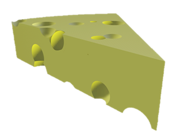

 

  
  <h1 align="center">MatSCAD
</h1>
    

Toolbox for simple design of 3D objects and import them in a CAD files.
  

## Usage
1. Instal [openSCAD](https://openscad.org/)
2. If it was installed in 'C:\Program Files\OpenSCAD\' than go to next step, if it was installed in another folder, use [SetOpenSCAD('path', "real folder of openSCAD")](set_openscad_folder.m). SetOpenSCAD() need to be started 1 time to point new folder.
3. Write a code.
See the [example 1](example.m) and [example 2](example2.m).

## List of functions
See the [list of functions](list_of_functions.md) .

## License
Distributed under the MIT License. See [`LICENSE`](LICENSE) for more information.

## Contact
Project Link: [alekseikukin/matscad](https://github.com/alekseikukin/matscad) .

